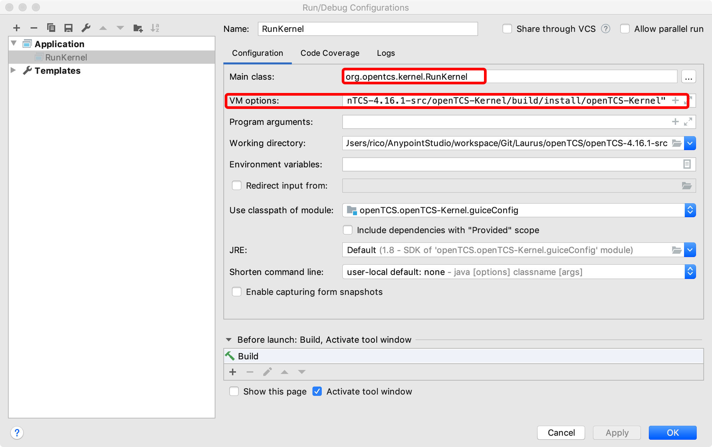
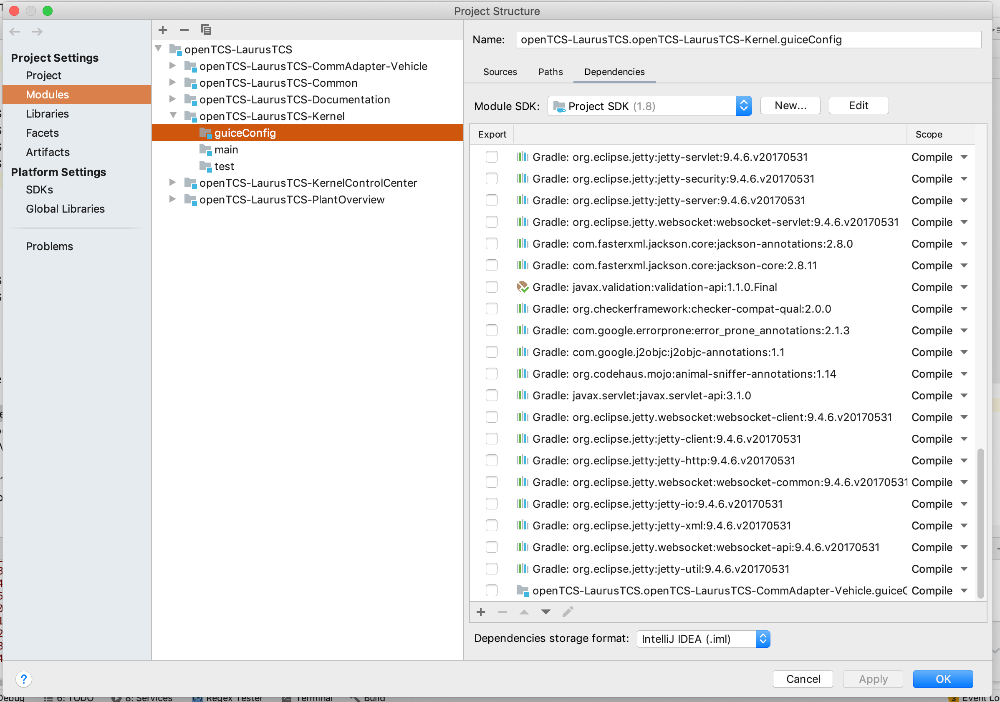

# OpenTCS-IDEA-Debug环境配置

## 项目启动配置:



## VM-Option配置

```shell
-enableassertions -Djava.security.policy=/Users/rico/AnypointStudio/workspace/Git/Laurus/openTCS/openTCS-4.16.1-src/openTCS-Kernel/build/install/openTCS-Kernel/config/java.policy -Djava.util.logging.config.file=/Users/rico/AnypointStudio/workspace/Git/Laurus/openTCS/openTCS-4.16.1-src/openTCS-Kernel/build/install/openTCS-Kernel/config/logging.config -Dopentcs.base="/Users/rico/AnypointStudio/workspace/Git/Laurus/openTCS/openTCS-4.16.1-src/openTCS-Kernel/build/install/openTCS-Kernel" -Dopentcs.home="/Users/rico/AnypointStudio/workspace/Git/Laurus/openTCS/openTCS-4.16.1-src/openTCS-Kernel/build/install/openTCS-Kernel"
```

## LOG配置

```properties
# 1、指定全局所有class默认以INFO级别打印
.level= INFO

# 2、指定包、类的日志输出级别
org.opentcs.util.CyclicTask.level = ALL
org.opentcs.drivers.vehicle.BasicVehicleCommAdapter.level = ALL
org.opentcs.kernel.KernelStateOperating.level = ALL
org.opentcs.strategies.basic.level = ALL
org.opentcs.kernel.services.level = ALL
org.opentcs.virtualvehicle.level = ALL
org.opentcs.kernel.vehicles.level = ALL
org.opentcs.kernel.workingset.level = INFO
org.opentcs.level = INFO
java.level = WARNING
org.eclipse = WARNING
javax.level = WARNING
sun.level = WARNING
com.level = WARNING

# 3、限制控制台最高输出级别(不管2中特定包的级别多高，都会在这里被过滤掉)
handlers= java.util.logging.ConsoleHandler
java.util.logging.ConsoleHandler.level = ALL
java.util.logging.ConsoleHandler.formatter = org.opentcs.util.logging.SingleLineFormatter


```


## 通过Example clone出来的项目Debug过程不加在自定义驱动问题：
将：
openTCS-LaurusTCS.openTCS-LaurusTCS-CommAdapter-Vehicle.guiceConfig
添加到openTCS-LaurusTCS.openTCS-LaurusTCS-Kernel.guiceConfig的dependence中

